# Coral Detection on White Square Holders

This repository provides an automated image analysis pipeline for detecting and segmenting coral specimens held in white plastic square holders within aquarium rack photographs. Images captured at high resolution (7008 × 4672 px) are processed using two trained random-forest classifiers — one to identify the white holder frames, and one to segment the coral tissue within each frame — combined with morphological image operations to clean and sharpen the detected regions. The pipeline locates each holder in the image, assigns it a grid position label (R{row}C{col}), and extracts the precise polygon contour of the coral specimen inside it. These contours are exported as CSV files and loaded directly into ImageJ as named ROIs, where they can be overlaid on the original high-resolution images. The goal is to non-destructively measure coral shape and area across time points, enabling growth metrics such as surface area change and morphological development to be tracked without disturbing the specimens.

Note: a large neural network or transformer would provide higher quality detections, but would require GPU and more training. This tool is designed to be a relatively simple/low-tech/configurable approach that doesn't require a high-performing computer to rework. It's not a perfect tool, and will still require some "manual handling" of the images, but it's a quick and dirty solution that should help speed up the science.

Made by Dorian Tsai to support AIMS & SeaSim scientific experiments.


---

## Files

### Detection

| File | Purpose |
|---|---|
| `detect_corals_on_white_squares.py` | Main pipeline — run directly or called by the ImageJ macro |
| `detect_calibration_circles.py` | Standalone calibration-disc detector (also called from the main pipeline at Step 14) |
| `run_detection.ijm` | ImageJ macro — calls the Python script and loads ROIs into ROI Manager |
| `debug_pipeline.py` | Saves step-by-step intermediate images to `debug/<image_stem>/` |
| `calibration_README.md` | Detailed step-by-step description of the calibration circle detection algorithm |

### Training

| File | Purpose |
|---|---|
| `label_annotate.py` | Samples training images and generates annotated label previews |
| `bbox_labeler.py` | Interactive GUI for drawing `white` / `coral` / `other` bounding boxes |
| `classifier_utils.py` | Shared feature extraction and training logic (imported by the two scripts below) |
| `train_white_classifier.py` | Trains the `WhiteTabClassifier` — white frame vs coral + other |
| `train_coral_classifier.py` | Trains the `CoralClassifier` — coral vs white frame + other |
| `test_classifier.py` | Applies a trained model to images and writes mask / overlay / compare outputs |

---

## Usage

### Detection

```bash
# Single image
python3 detect_corals_on_white_squares.py images/DSC00150.JPG output/

# Entire directory
python3 detect_corals_on_white_squares.py images/ output/

# Generate step-by-step debug images
python3 debug_pipeline.py images/ debug/
```

### Training workflow

```bash
# 1. Sample 10 images and create label templates (run once)
python3 label_annotate.py

# 2. Draw bounding boxes interactively
#    Keys: [w] white  [c] coral  [o] other
#          left-drag = draw  right-click = delete  [n]/[p] = next/prev  [q] = quit
python3 bbox_labeler.py

# 3. Train both classifiers
python3 train_white_classifier.py
python3 train_coral_classifier.py

# 4. Inspect masks on training images
python3 test_classifier.py
```

---

## Output per image

| File | Contents |
|---|---|
| `<stem>_annotated.jpg` | Original image with green ROI boxes, orange coral contours, and magenta calibration circles |
| `<stem>_rois.csv` | `row, col, x, y, width, height, center_x, center_y` (full-resolution pixels) |
| `<stem>_rois.json` | Same ROI data as JSON, consumed by the ImageJ macro |
| `<stem>_contours.csv` | Coral contour vertices: `row, col, point_idx, x, y` — one row per polygon point |
| `<stem>_calibration_rois.csv` | `side, idx, x, y, width, height, center_x, center_y, radius` — one row per calibration circle (8 total: L0–L3, R0–R3) |
| `<stem>_calibration_rois.json` | Same calibration data as JSON with image dimensions and full metadata |

---

### Coordinate system

All pixel coordinates use the **image coordinate system**: origin `(0, 0)` is
the **top-left corner** of the full-resolution image, `x` increases to the
right, and `y` increases downward.

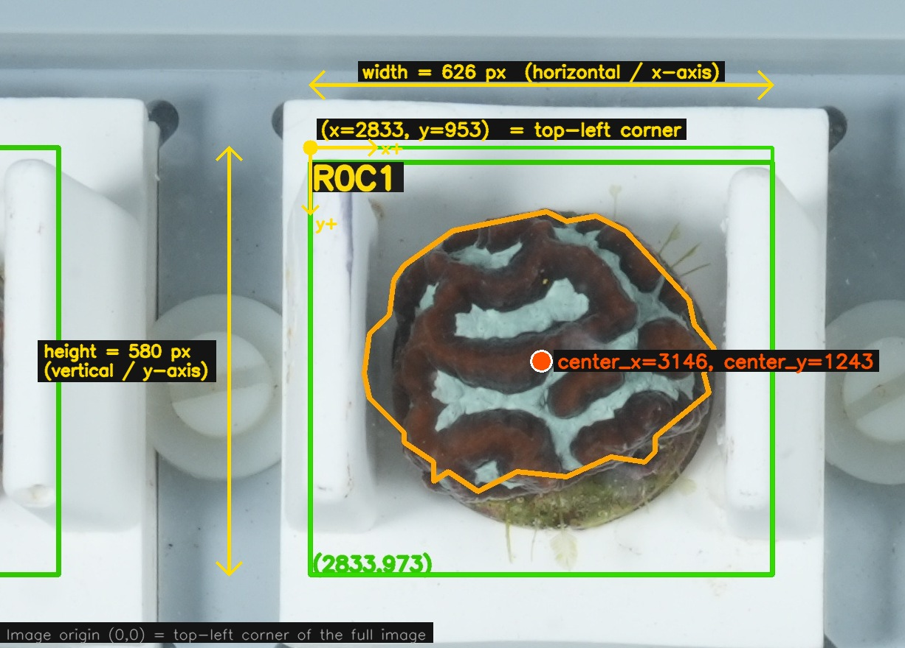

| Field | Definition |
|---|---|
| `x` | Left edge of the bounding box, in full-resolution pixels from the left of the image |
| `y` | Top edge of the bounding box, in full-resolution pixels from the top of the image |
| `width` | Horizontal extent of the box in pixels (along the x-axis, left → right) |
| `height` | Vertical extent of the box in pixels (along the y-axis, top → bottom) |
| `center_x` | `x + width / 2` — horizontal centre of the box |
| `center_y` | `y + height / 2` — vertical centre of the box |

---

### `_rois.csv` / `_rois.json` — white square holder ROIs

One row per detected white square holder.

```
row, col, x, y, width, height, center_x, center_y
0, 0, 1886, 953, 606, 580, 2189, 1243
0, 1, 2833, 973, 626, 560, 3146, 1253
...
```

| Field | Type | Description |
|---|---|---|
| `row` | int | Zero-based row index in the grid (0 = topmost row) |
| `col` | int | Zero-based column index in the grid (0 = leftmost column) |
| `x` | int | Left edge of the white square ROI (full-resolution pixels) |
| `y` | int | Top edge of the white square ROI (full-resolution pixels) |
| `width` | int | Width of the ROI (horizontal, x-axis) |
| `height` | int | Height of the ROI (vertical, y-axis) |
| `center_x` | int | Horizontal centre of the ROI |
| `center_y` | int | Vertical centre of the ROI |

The JSON version (`_rois.json`) wraps these fields in an `"rois"` array and
adds `"image"`, `"image_width"`, and `"image_height"` at the top level.

---

### `_contours.csv` — coral polygon vertices

One row per polygon vertex; rows for the same holder are contiguous and share
the same `(row, col)`.

```
row, col, point_idx, x, y
0, 0, 0, 2110, 1050
0, 0, 1, 2145, 1038
...
0, 1, 0, 3020, 1080
...
```

| Field | Type | Description |
|---|---|---|
| `row`, `col` | int | Grid position of the holder this contour belongs to |
| `point_idx` | int | Zero-based index of this vertex within the polygon |
| `x`, `y` | int | Full-resolution pixel coordinates of the vertex |

To reconstruct the polygon for a given holder, select all rows with matching
`(row, col)`, sort by `point_idx`, and read off the `x`, `y` columns.

### Using `_contours.csv` in ImageJ

```javascript
// Load the CSV, group rows by (row, col), then for each group:
makeSelection("polygon", xArray, yArray);
roiManager("add");
```

---

### `_calibration_rois.csv` / `_calibration_rois.json` — calibration disc ROIs

One row per calibration disc (8 total: L0–L3 on the left panel, R0–R3 on the
right panel, ordered top to bottom).

```
side, idx, x, y, width, height, center_x, center_y, radius
L, 0, 213, 640, 346, 346, 386, 813, 173
L, 1, 134, 947, 452, 452, 360, 1173, 226
...
R, 0, 6333, 840, 320, 320, 6493, 1000, 160
...
```

| Field | Type | Description |
|---|---|---|
| `side` | str | `L` = left panel, `R` = right panel |
| `idx` | int | 0–3, top to bottom within the panel |
| `x` | int | Left edge of the bounding square enclosing the disc |
| `y` | int | Top edge of the bounding square enclosing the disc |
| `width` | int | `2 × radius` (bounding square width, horizontal) |
| `height` | int | `2 × radius` (bounding square height, vertical; equals `width`) |
| `center_x` | int | Horizontal pixel coordinate of the disc centre |
| `center_y` | int | Vertical pixel coordinate of the disc centre |
| `radius` | int | Disc radius in full-resolution pixels |

The disc label is `{side}{idx}` (e.g. `L0`, `R3`). In ImageJ the discs are
loaded as `makeOval` ROIs using `(x, y, width, height)`.

The JSON version adds `"image"`, `"image_width"`, `"image_height"`, and
`"calibration_circles_detected"` at the top level.

---

## Configuration parameters

All tunable constants sit at the top of their respective script so they can be
adjusted without touching any algorithm logic.  Values shown below are the
defaults; pixel equivalents are calculated for the standard 7008 × 4672 px
camera output.

---

### `detect_corals_on_white_squares.py` — white-square and coral detection

#### Scaling

| Parameter | Value | Units | Meaning | Typical range |
|---|---|---|---|---|
| `PROCESS_SCALE` | `0.15` | fraction | Image is downscaled to this fraction before all white-square detection (Steps 1–13). Coordinates are scaled back to full resolution at the end. For a 7008 × 4672 px image this gives a 1051 × 700 px working image. | 0.10 – 0.25 — lower is faster; go higher if small squares are missed |

#### White pixel mask — HSV fallback (Steps 2–3, used only without a trained model)

| Parameter | Value | Units | Meaning | Typical range |
|---|---|---|---|---|
| `HSV_V_MIN` | `185` | 0 – 255 (HSV Value) | Minimum brightness a pixel must have to be classified as white. Pixels below this threshold are excluded regardless of saturation. | 160 – 220 — lower catches dim frames but adds coloured noise |
| `HSV_S_MAX` | `65` | 0 – 255 (HSV Saturation) | Maximum colour saturation allowed for a white pixel. Values above this are considered too coloured to be the white plastic frame. | 40 – 90 |

#### Blob size and shape filter (Step 4)

| Parameter | Value | Units | Meaning | Typical range |
|---|---|---|---|---|
| `MIN_BLOB_FRAC` | `0.002` | fraction of image area | Minimum inner-blob area as a fraction of the total image area. At 15 % scale this is ≈ 1 470 px²; at full resolution ≈ 65 000 px² (roughly a 255 × 255 px square). Smaller blobs are rejected as noise. | 0.001 – 0.005 |
| `MAX_BLOB_FRAC` | `0.10` | fraction of image area | Maximum inner-blob area. At 15 % scale ≈ 73 570 px²; full resolution ≈ 3.3 M px². Prevents large merged regions from being treated as a single square. | 0.05 – 0.20 |
| `MAX_BLOB_ASPECT` | `2.0` | dimensionless (long ÷ short side) | Maximum allowed aspect ratio of the bounding box. Rejects long thin artefacts (rails, shadows) while passing squares (aspect ≈ 1). | 1.5 – 3.0 |

#### White mask morphology (Steps 3a–3b, at 15 % scale)

| Parameter | Value | Units | Full-res equivalent | Meaning | Typical range |
|---|---|---|---|---|---|
| `DENOISE_KSIZE` | `5` | px (must be odd) | ≈ 33 px | Median blur kernel applied to the raw white mask. Removes salt-and-pepper noise from the random forest classifier without smearing frame edges. | 3 – 9 |
| `CLOSE_KSIZE` | `15` | px (must be odd) | ≈ 100 px | Square morphological close kernel. Seals gaps in the white frame edges caused by reflections or lighting variation. Increase if frame borders appear broken; decrease if separate frames start merging. | 9 – 25 |

#### ROI border (Step 10)

| Parameter | Value | Units | Meaning | Typical range |
|---|---|---|---|---|
| `ROI_BORDER_FRAC` | `0.15` | fraction of blob dimension | Each detected blob (dark interior) is expanded by this fraction of its own width/height on every side to include the surrounding white plastic frame wall. 0.15 = 15 % extra on each of the four sides. | 0.05 – 0.30 |

#### Coral mask morphology (Steps 11–12, at 15 % scale, elliptical kernels)

| Parameter | Value | Units | Full-res equivalent | Meaning | Typical range |
|---|---|---|---|---|---|
| `CORAL_DENOISE_KSIZE` | `3` | px (must be odd) | ≈ 20 px | Median blur on the raw coral classifier output. Removes isolated noise pixels from the RF prediction before morphological cleanup. | 3 – 7 |
| `CORAL_CLOSE_KSIZE` | `7` | px (must be odd) | ≈ 46 px | Elliptical morphological close applied to the coral mask. Seals small holes and smooths the coral outline inward. Increase to close larger gaps in branching corals; decrease to preserve fine detail. | 3 – 15 |
| `CORAL_OPEN_KSIZE` | `3` | px (must be odd) | ≈ 20 px | Elliptical morphological open applied after closing. Removes small noise patches that survive closing. | 3 – 7 |

---

### `detect_calibration_circles.py` — calibration disc detection

See also **[`calibration_README.md`](calibration_README.md)** for a full description with diagrams.

#### Scaling

| Parameter | Value | Units | Meaning | Typical range |
|---|---|---|---|---|
| `PROCESS_SCALE` | `0.25` | fraction | Image is downscaled to this fraction before Hough circle detection. For 7008 × 4672 px this gives 1752 × 1168 px. Used independently of `PROCESS_SCALE` in the main script. | 0.15 – 0.35 — lower than 0.20 makes discs too small for Hough; higher than 0.35 adds little accuracy |

#### Search strip geometry (applied at `PROCESS_SCALE`)

All `*_FRAC` values are fractions of the **downscaled** image dimension.

| Parameter | Value | Units | Small-image value (1752 × 1168 px) | Full-res equivalent | Meaning | Typical range |
|---|---|---|---|---|---|---|
| `CALIB_X_LO_FRAC` | `0.010` | fraction of small-image width | 17 px from each edge | 70 px | Inner x boundary of the search strip. Clears image-edge hardware (corner brackets, frame bolts) that would otherwise generate false candidates. | 0.005 – 0.03 |
| `CALIB_X_HI_FRAC` | `0.250` | fraction of small-image width | 438 px from each edge | 1752 px | Outer x boundary — covers the full width of the grey calibration panel. The scoring function keeps the correct tight column within this wider zone. | 0.15 – 0.35 |
| `CALIB_Y_MIN_FRAC` | `0.010` | fraction of small-image height | 11 px from top | 46 px | Rows above this are excluded from candidate search. Removes panel corner reflections and frame bolt structures at the top of the image. | 0.0 – 0.05 |
| `CALIB_Y_MAX_FRAC` | `0.990` | fraction of small-image height | 11 px from bottom | 46 px | Rows below this are excluded. Mirrors `CALIB_Y_MIN_FRAC` for the bottom edge. | 0.95 – 1.0 |

#### Circle size (applied at `PROCESS_SCALE`)

| Parameter | Value | Units | Small-image radius | Full-res radius | Full-res diameter | Meaning | Typical range |
|---|---|---|---|---|---|---|---|
| `CALIB_R_MIN_FRAC` | `0.025` | fraction of small-image width | 43 px | 172 px | 344 px | Minimum disc radius passed to `HoughCircles`. Discs detected smaller than this are ignored. Set below the smallest expected disc; the anchor-pair scorer picks the correct size within the range. | 0.015 – 0.035 |
| `CALIB_R_MAX_FRAC` | `0.050` | fraction of small-image width | 87 px | 348 px | 696 px | Maximum disc radius. Discs detected larger than this are ignored. Should comfortably exceed the largest disc across all expected camera distances and zoom levels. | 0.040 – 0.080 |

#### Grid geometry (fixed, match physical rig)

| Parameter | Value | Meaning |
|---|---|---|
| `N_ROWS` | `4` | Number of calibration discs per column (must match the physical rig). |
| `N_TOTAL` | `8` | Total discs expected (= 2 × `N_ROWS`). Used for output validation and status reporting. |

---

## Algorithm — Step by Step

All example images are from `DSC00150.JPG`.

---

### Step 1 — Downscale

The input image (7008 × 4672 px) is resized to **15%** of its original size
before any processing. All detection runs on this small version; coordinates
are scaled back to full resolution at the end. This gives ~45× speedup with
negligible accuracy loss for centimetre-scale objects.

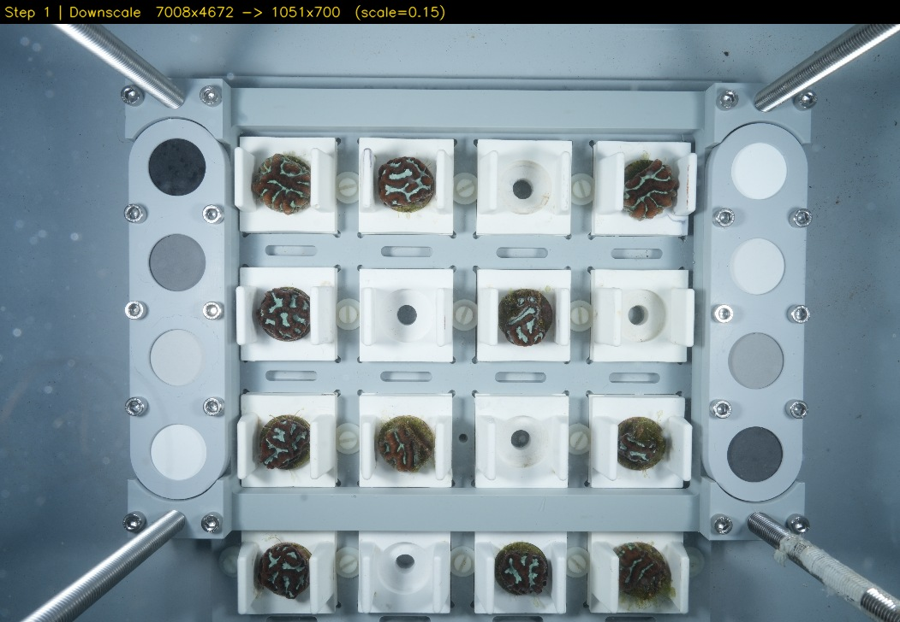

---

### Step 2 — White Pixel Mask (WhiteTabClassifier)

Every pixel in the downscaled image is classified as **white frame** (255) or
**other** (0) using a trained **random forest classifier** (`WhiteTabClassifier`).

Each pixel is described by nine features — B, G, R in BGR space; H, S, V in
HSV space; L, a, b in CIE L\*a\*b\* space — all normalised to \[0, 1\]. The forest
(200 trees, max depth 20) was trained on bounding-box labels drawn with
`bbox_labeler.py` using the `[w]hite` and `[o]ther` / `[c]oral` classes.

If no trained model is found, the pipeline falls back to an HSV brightness
threshold (Value ≥ 185, Saturation ≤ 65).

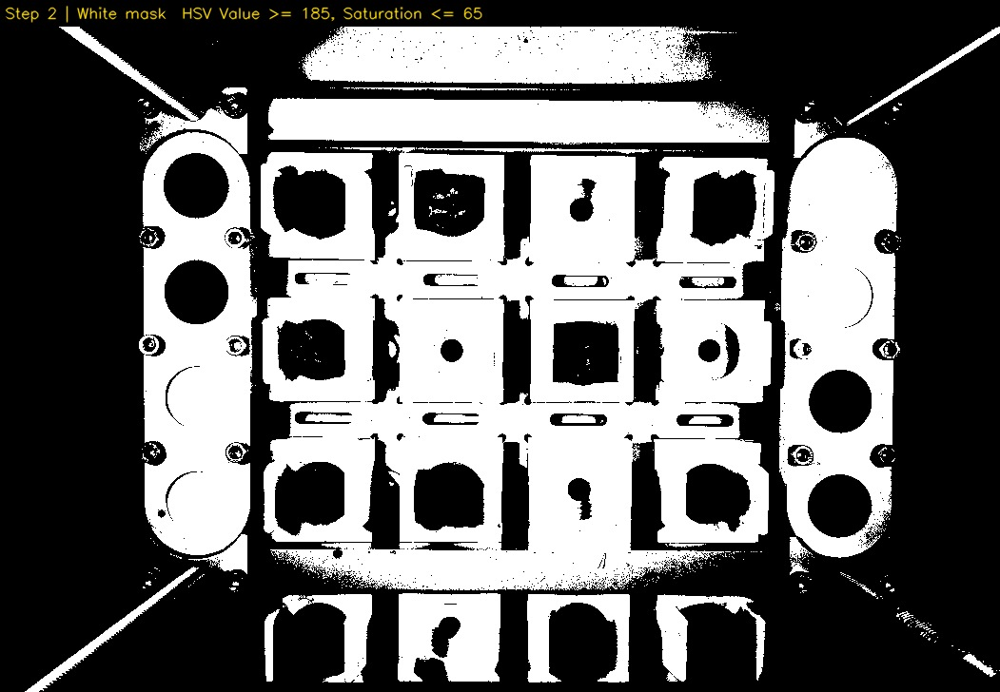

---

### Step 3a — Denoise (Median Blur)

A **5 × 5 median blur** removes salt-and-pepper noise introduced by the random
forest classifier without smearing the structural edges of the white frames.

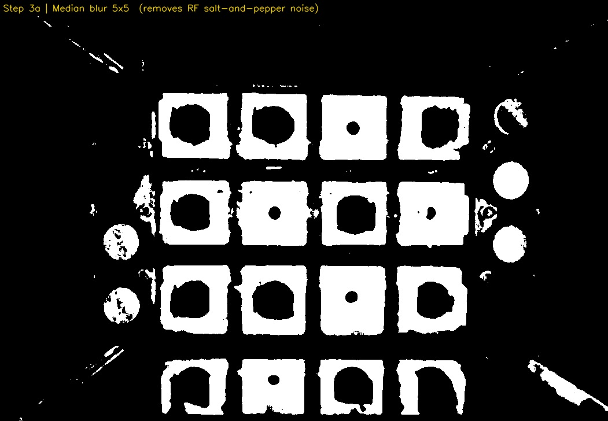

---

### Step 3b — Morphological Close

A **15 × 15 square closing** (dilation then erosion) seals remaining small
breaks in the white frame edges caused by lighting variation or reflections,
making each square frame a fully enclosed white region.

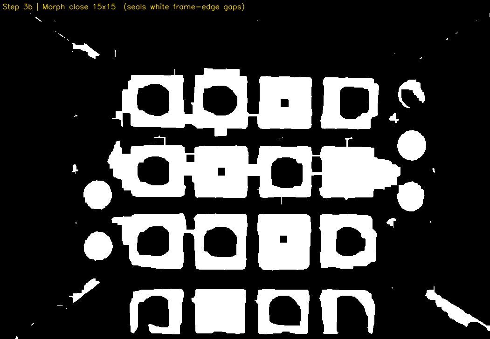

---

### Step 3c — Inner Contour Detection (RETR_CCOMP Hierarchy)

`cv2.findContours` with `RETR_CCOMP` returns a two-level hierarchy:

- **Level 0 (outer)** — contours around white regions (the frames)
- **Level 1 (inner / child)** — contours around dark regions *enclosed* by white

Only level-1 contours are kept. These are the dark coral or reference dots
inside each white frame. Background darkness and open-sided regions are
automatically excluded. Many of these inner blobs are still noise — removed
in Steps 4 and 5.

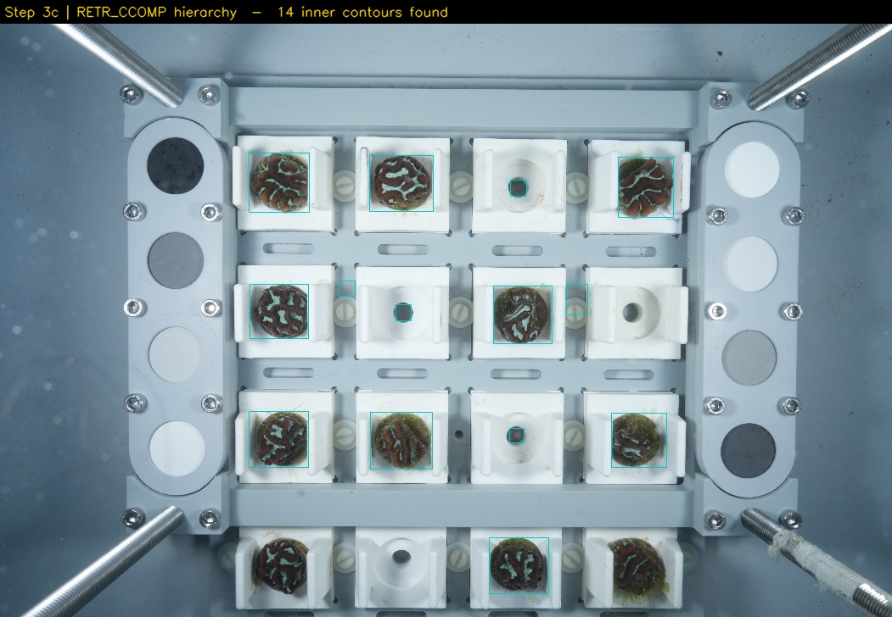

---

### Step 4 — Size and Aspect-Ratio Filter

Each inner contour's bounding box is tested against two criteria:

| Criterion | Value | Reason |
|---|---|---|
| Area / image area | 0.2% – 10% | Rejects tiny noise and large merged regions |
| Aspect ratio (long / short side) | < 2.0 | Rejects long thin artefacts |

**Green = passes. Red = fails.**


---

### Step 5 — Four-Direction White Border Check

A thin strip is sampled on each of the **four sides** of every remaining blob.
Each strip must contain **≥ 8% white pixels**. The percentage shown is the
weakest of the four sides.

This removes dark regions open on one side — shadows against a frame edge, or
artefacts that pass the size filter but sit against a non-white background.

> **Note:** Calibration disc holders (grey circles on the side panels) also
> pass this check — they are enclosed by white on all sides. They are removed
> in Step 8.

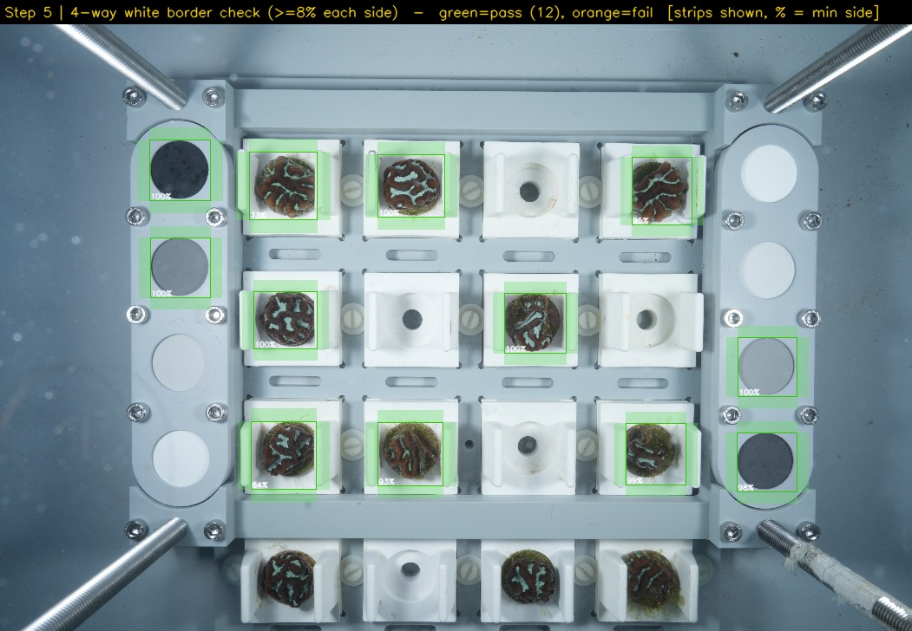

---

### Step 6 — Strategy Selection

The number of **distinct column positions** among surviving blobs is counted.
If **≥ 3 distinct columns** are found, the simple 15 × 15 close (Strategy 1)
is sufficient and the pipeline proceeds to Step 7.

If fewer than 3 columns are found — typically in close-up images where some
frame top edges are cropped — **Strategy 2 (directional close fallback)** tries
tall-narrow kernels (e.g. 20 × 4 px, then 4 × 20 px) in increasing sizes
(20, 30, 40, 50 px) and selects the one that produces the most columns.

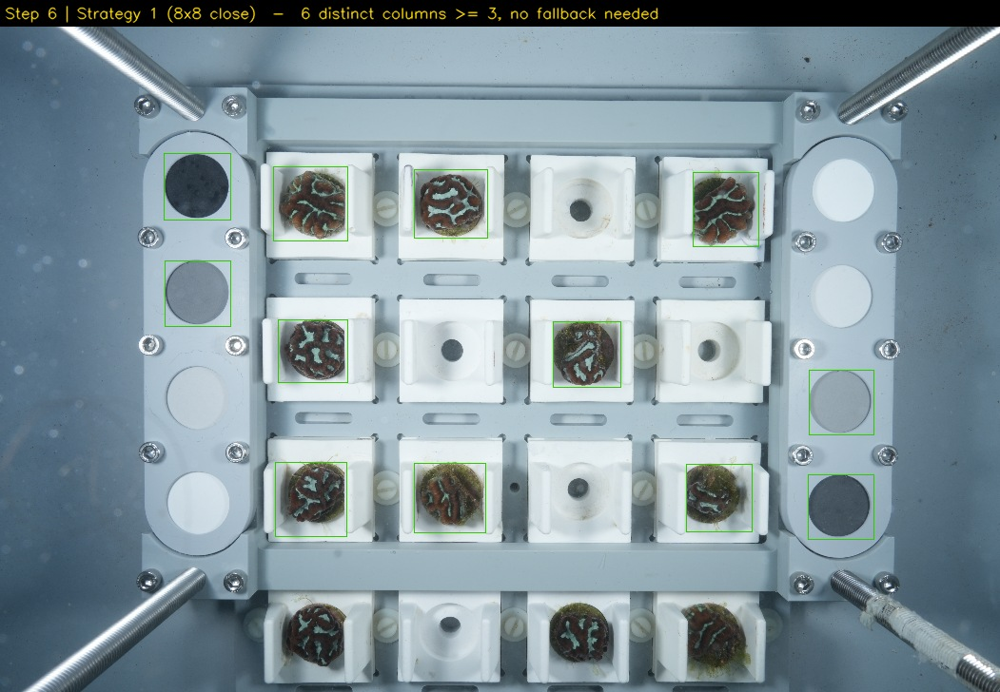

---

### Step 7 — 1D Clustering into Rows and Columns

The Y-centres of all blobs are clustered independently from the X-centres
using a gap threshold of 60% of the median blob dimension. The **median
position** of each cluster becomes a row or column centre.

Orange lines = row centres. Blue lines = column centres (before calibration
pruning).

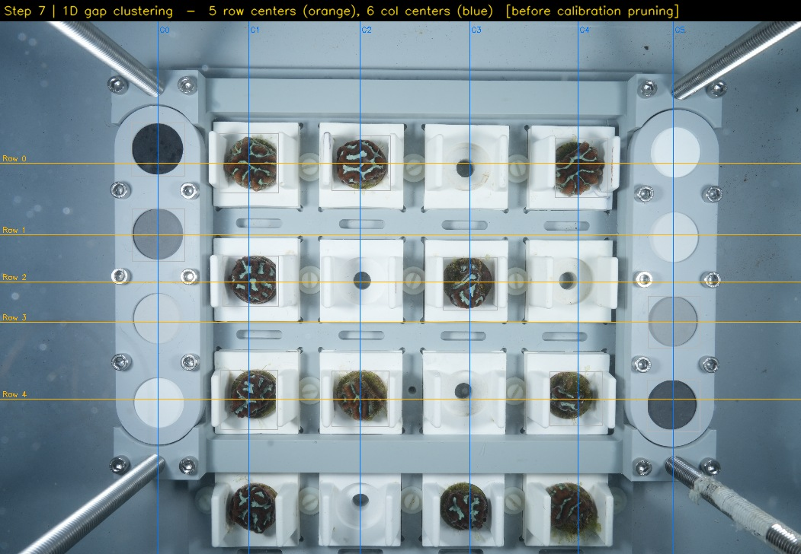

---

### Step 8 — Calibration Column Pruning

Calibration disc holders sit *slightly closer* to the coral grid than coral
holders are to each other. The algorithm compares each edge column gap to the
**inner-spacing median** (coral-to-coral reference, excluding outermost gaps):

```
threshold = 0.93 × inner_median_spacing
```

Any outermost column whose gap is below this threshold is removed. Calibration
gaps have ratios ≤ 0.92; coral gaps ≥ 0.99 — a clean separation.

**Before pruning** — 6 columns detected:

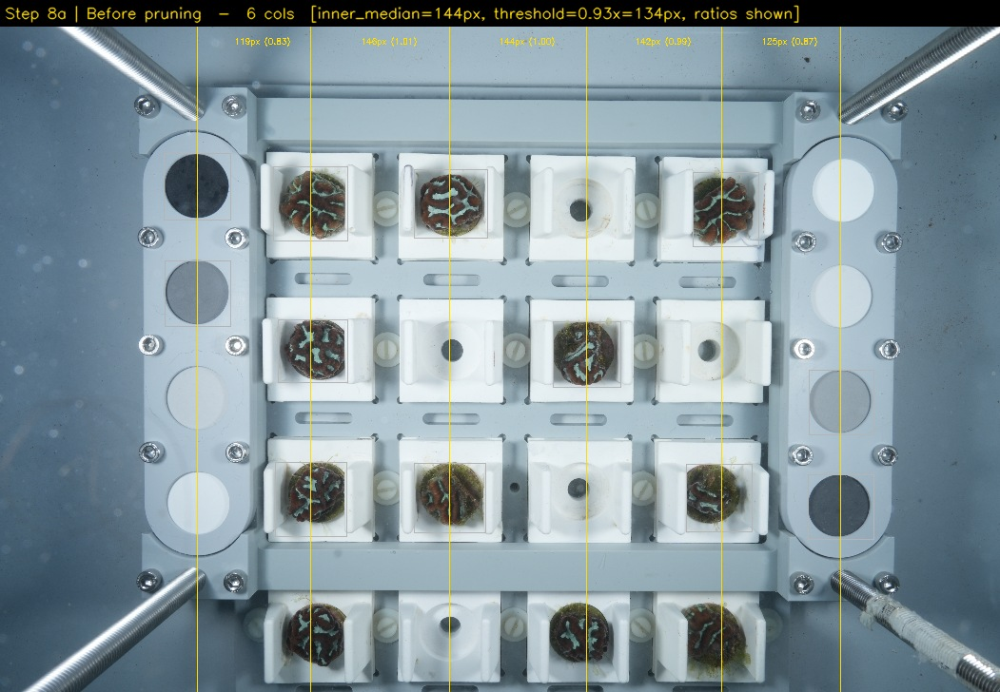

**After pruning** — 2 red calibration columns removed, 4 green coral columns kept:


---

### Step 9 — Grid Assignment

Each surviving blob is assigned to its nearest row and column centre, giving a
zero-based `(row, col)` index. Each grid cell is shown in a distinct colour.

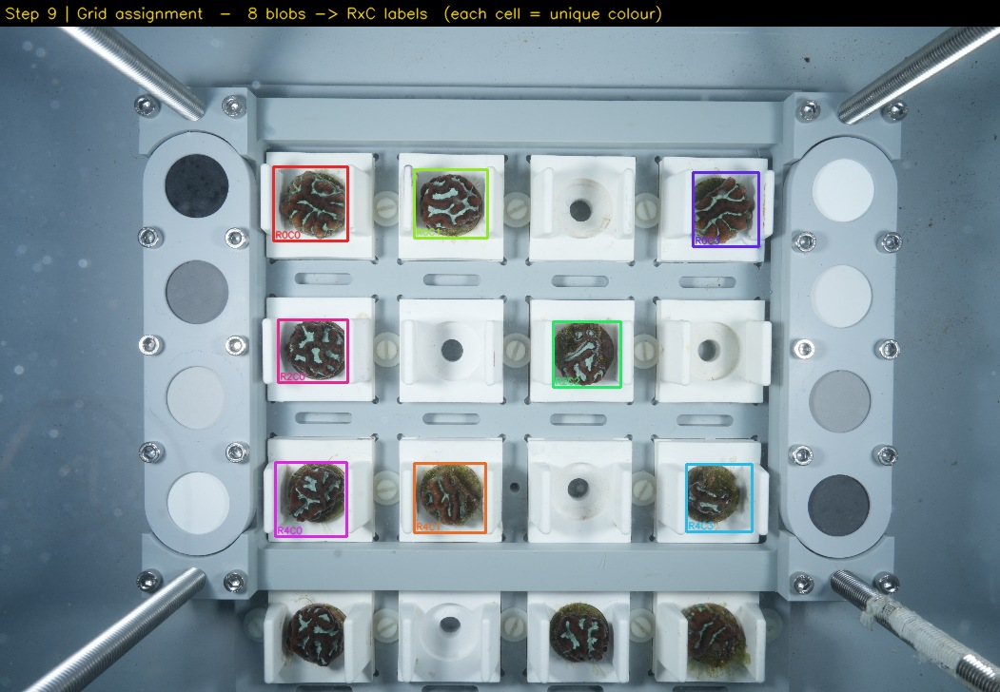

---

### Step 10 — Expand ROI to White Square Boundary

The raw blob bounding box covers only the **dark interior** (the coral). The
ROI is expanded outward by **15% of the blob dimensions** on each side to
include the white plastic frame walls:

```
border_x = median_blob_width  × 0.15
border_y = median_blob_height × 0.15
```

All coordinates are scaled back to full-resolution pixels. The result is a
tight ROI around each individual white square holder.

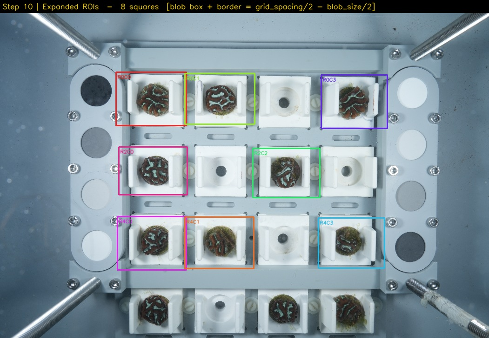

---

### Step 11 — Coral Pixel Mask (CoralClassifier, raw)

Within each ROI's crop from the **15%-scale image**, the `CoralClassifier`
random forest labels every pixel as **coral** (255) or **other** (0). The same
nine-feature representation (B G R H S V L a\* b\*) is used as in Step 2.

The raw output typically contains salt-and-pepper noise and slightly ragged
edges — addressed in Step 12.

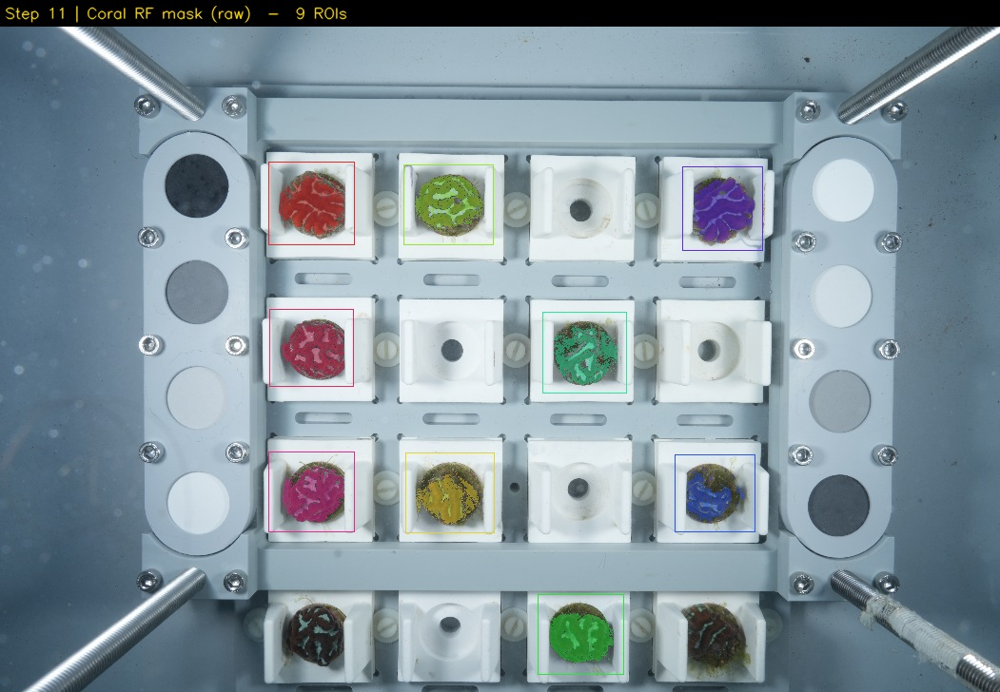

---

### Step 12 — Coral Mask Morphological Cleanup

Three operations round and clean the raw coral mask:

1. **Median blur (3 × 3)** — removes isolated noise pixels.
2. **Elliptical morphological close (7 × 7)** — seals small gaps and rounds
   the coral outline inward.
3. **Elliptical morphological open (3 × 3)** — removes small noise patches
   remaining after closing.

Elliptical structuring elements are used (rather than square) to produce a
smoother, more organic contour.

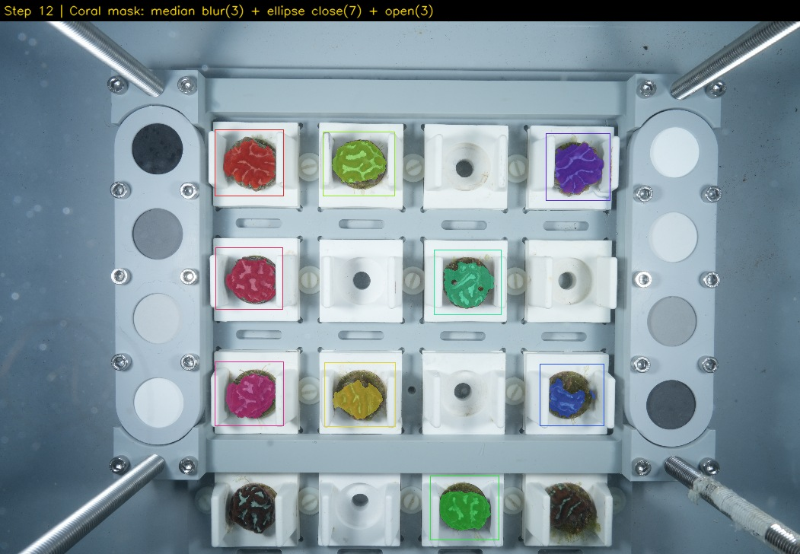

---

### Step 13 — Coral Contour

The **largest connected dark region** in each cleaned coral mask is extracted
as a polygon contour, simplified to ~0.3% of the shorter ROI dimension, and
scaled back to full-resolution coordinates. The contour is drawn in orange on
the annotated output image and written to `_contours.csv`.

If no `CoralClassifier` model is found (i.e. before training), the pipeline
falls back to an **Otsu threshold** applied to the full-resolution ROI crop.

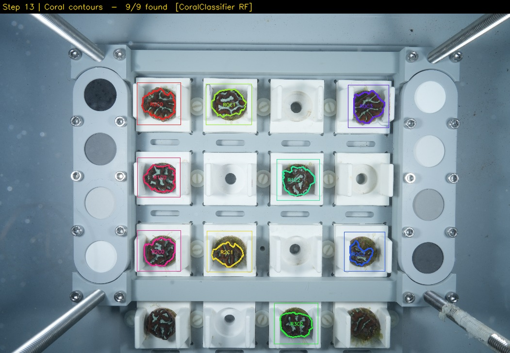

---

### Step 14 — Calibration Circle Detection

Step 14 is handled by **`detect_calibration_circles.py`** (imported into the
main pipeline at runtime). The image is resampled to **25%** for this step
independently of the 15% scale used for white-square detection.

Each image contains exactly **8 calibration discs** — 4 on the left side panel
and 4 on the right — arranged in a fixed 2-column × 4-row grid. The discs span
the full luminance range by design: one near-black, one near-white, and two
intermediate greys per column, in monotone order top-to-bottom.

**Algorithm summary (anchor-pair):**

1. Crop a narrow vertical strip from each side of the image (outer ¼ of image
   width) and run `HoughCircles` on two preprocessed sources: a
   tophat+blackhat disc-anomaly image and a CLAHE-enhanced raw strip.
2. Sample mean grey at each candidate using a **fixed-radius** disc
   (`r_min // 2`) — critical for correctly ranking the white disc, which Hough
   sometimes detects at 2× its true radius.
3. Test every pair from the **top-20 darkest × top-20 brightest** candidates
   as column endpoints (400 pairs max). For each passing pair, fill intermediate
   rows by nearest-neighbour search in a tight ±1.5 × r_min horizontal window.
4. Score each 4-circle hypothesis:
   ```
   score = (gray_range / 200) × monotonicity
           ──────────────────────────────────────────────────
           1 + sp_cv + r_cv × 0.5 + x_cv × 2.0 + y_match × 2.0
   ```
   where `sp_cv` penalises uneven row spacing, `x_cv` penalises non-vertical
   columns, and `y_match` is a soft constraint ensuring L and R rows are at the
   same physical heights (the left column is detected first; its y-positions
   guide the right column search).
5. Cap any anchor-disc radius more than 30% above the inner-circle median
   (Hough over-detection artefact).

**Result on the 6-image test set:** all 48 circles detected, ~25 px mean centre
error at full resolution (~1.9 s/image).

For the full step-by-step description with visualisations, see
**[`calibration_README.md`](calibration_README.md)**.

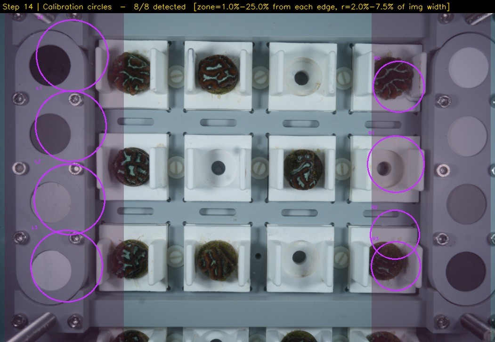

---

### Final Output

Green boxes mark the white square ROI boundaries; orange outlines trace the
coral specimens; **magenta circles** mark the 8 calibration discs. Each ROI is
labelled with its `R{row}C{col}` grid position and each calibration circle with
its `{side}{idx}` label (L0–L3, R0–R3).

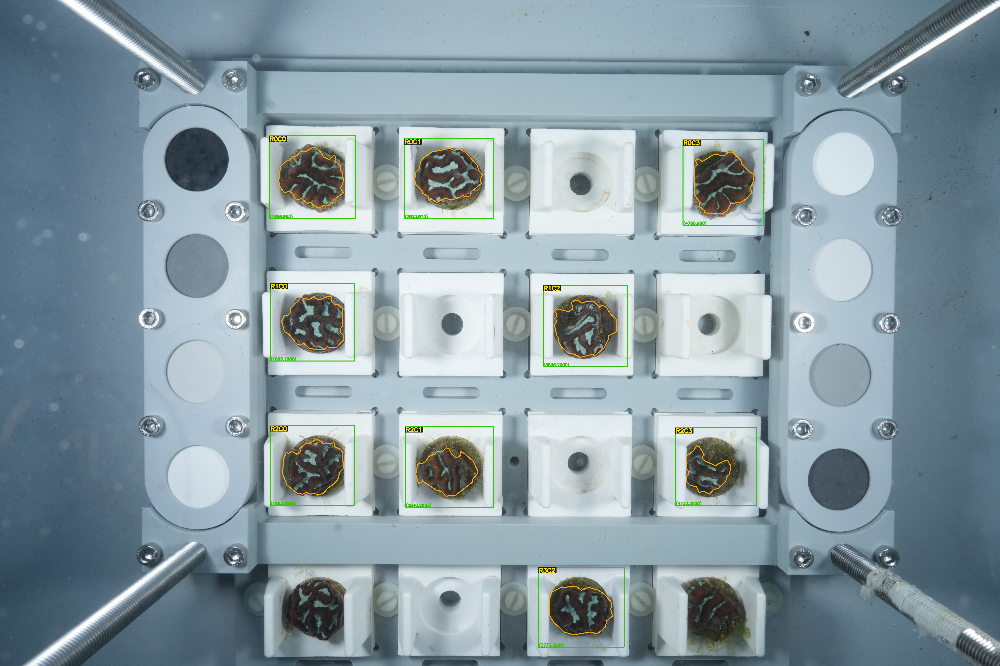

---

## Training the Classifiers

Both classifiers share the same nine-feature pixel representation and are
trained from bounding-box labels drawn over a sample of 10 images.

### Labelling with `bbox_labeler.py`

`bbox_labeler.py` is an interactive GUI for drawing training labels. Press
`[w]` / `[c]` / `[o]` to choose the active class, then left-drag to draw a
box; right-click to delete; `[n]` / `[p]` to navigate; `[q]` to save and quit.

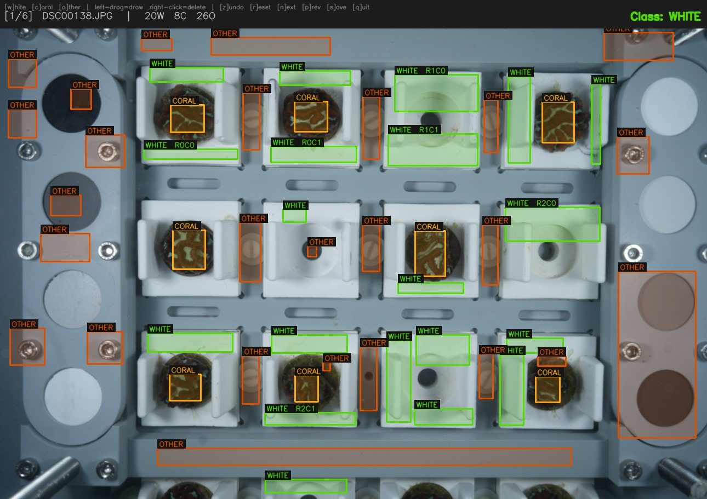

The info bar at the top shows the image counter, filename, box counts per
class, and the currently active class (green = WHITE, here). The hint row
across the top lists all keybindings.

Annotated label previews (written to `train/annotated/` by `label_annotate.py`)
show the same bounding boxes in a static image — useful for a quick audit of
coverage without opening the GUI:

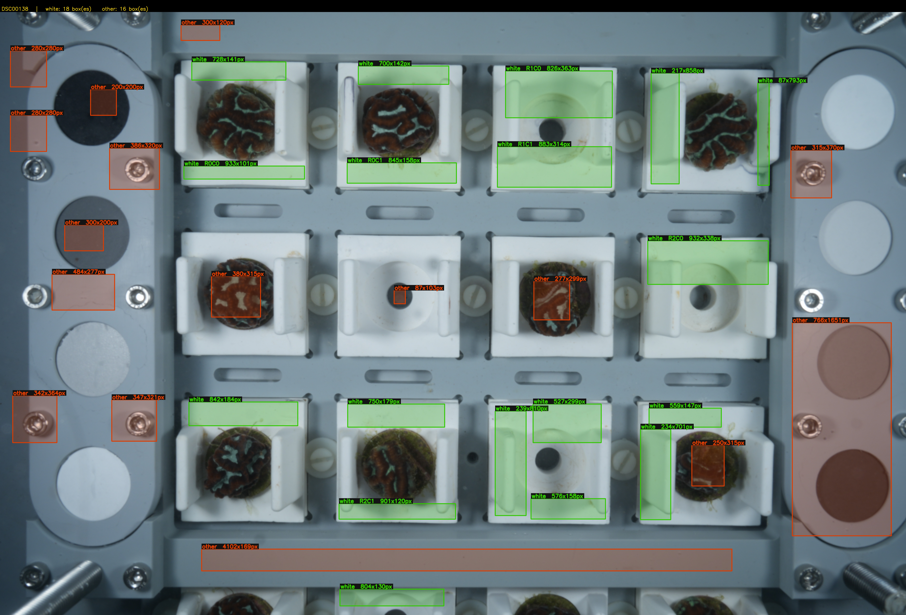

### Label classes

| Key | Label | Color | Used by |
|---|---|---|---|
| `w` | `white` | green | WhiteTabClassifier (positive), CoralClassifier (negative) |
| `c` | `coral` | orange | CoralClassifier (positive), WhiteTabClassifier (negative) |
| `o` | `other` | red | Both classifiers (negative) |

### Training data location

```
train/
  images/      10 randomly sampled full-resolution JPEGs
  labels/      one JSON per image with labeled ROI bounding boxes
  models/      YYYYMMDD_WhiteTabClassifier.joblib
               YYYYMMDD_CoralClassifier.joblib
  annotated/   label preview images (generated by label_annotate.py)
  output_masks/ mask / overlay / compare images (generated by test_classifier.py)
```

See [`train_README.md`](train_README.md) for the full step-by-step training workflow.

### JSON label format

```json
{
  "image": "train/images/DSC00150.JPG",
  "image_width": 7008,
  "image_height": 4672,
  "rois": [
    {"label": "white", "row": 0, "col": 0, "x": 1666, "y": 853,  "width": 1013, "height": 773},
    {"label": "coral",                      "x": 1750, "y": 950,  "width":  800, "height":  600},
    {"label": "other",                      "x":  100, "y": 100,  "width":  400, "height":  400}
  ]
}
```

---

## Known Limitation

Squares whose interior is **empty** (fully white) or contains only a very small
dark reference dot are not detected. The hole-in-white approach requires a dark
occupant large enough to form a detectable enclosed blob.

---

## Running via ImageJ (`run_detection.ijm`)

The macro calls `detect_corals_on_white_squares.py` from inside ImageJ, then
automatically loads the resulting ROIs into the **ROI Manager** as named regions.

---

### How it works

The macro locates `detect_corals_on_white_squares.py` in ImageJ's own `macros/`
folder, then calls it via ImageJ's `exec()` function, passing the image (or
directory) path and the output folder as separate arguments. When the script
finishes, the macro reads `<stem>_rois.csv` and `<stem>_contours.csv` and
populates the ROI Manager with:

- `R{row}C{col}` — rectangle around each white square holder
- `coral_R{row}C{col}` — polygon tracing the coral specimen inside it

---

### Required folder layout inside `macros/`

Both the macro and the Python script must live in ImageJ's `macros/` directory.
If you have trained classifiers, the model files go in a `train/models/`
subdirectory **relative to the script**:

```
macros/
├── run_detection.ijm
├── detect_corals_on_white_squares.py
├── detect_calibration_circles.py
└── train/
    └── models/
        ├── YYYYMMDD_WhiteTabClassifier.joblib
        └── YYYYMMDD_CoralClassifier.joblib
```

Without the model files the pipeline falls back to HSV thresholding (white mask)
and Otsu thresholding (coral contour), which still produces usable results.

---

### Platform setup

#### Ubuntu (Linux)

**1. Install Python dependencies**

```bash
pip3 install opencv-python numpy scikit-learn joblib
```

If you use a conda environment, activate it first:

```bash
conda activate <your-env>
conda install -c conda-forge opencv numpy scikit-learn joblib
```

**2. Find the ImageJ macros folder**

The default locations depend on how ImageJ was installed:

| Installation | Macros folder |
|---|---|
| Standalone ImageJ `.tar.gz` | `~/ImageJ/macros/` |
| Fiji (recommended) | `~/Fiji.app/macros/` |
| System package | `/usr/share/imagej/macros/` |

To confirm, open ImageJ and check the title bar — it shows the ImageJ root
directory. The `macros/` folder is directly inside it.

**3. Copy the files**

```bash
# Standalone ImageJ example — adjust path if using Fiji
cp detect_corals_on_white_squares.py ~/ImageJ/macros/
cp detect_calibration_circles.py     ~/ImageJ/macros/
cp run_detection.ijm                 ~/ImageJ/macros/

# Copy trained models if available
mkdir -p ~/ImageJ/macros/train/models/
cp train/models/*.joblib ~/ImageJ/macros/train/models/
```

**4. Run the macro**

Open ImageJ, then: **Plugins → Macros → Run…** → select `run_detection.ijm`.

In the dialog:
- **Process**: choose `Current image` (must have an image open) or
  `All images in a directory`.
- **Output folder**: `Same folder as image` writes outputs alongside the input;
  `Choose folder…` opens a folder picker.
- **Python command**: leave as `python3` for the system Python. If you use a
  conda environment, enter the full path, e.g.
  `~/anaconda3/envs/myenv/bin/python3`.

---

#### macOS

**1. Install Python dependencies**

With Homebrew Python:

```bash
pip3 install opencv-python numpy scikit-learn joblib
```

With conda:

```bash
conda activate <your-env>
conda install -c conda-forge opencv numpy scikit-learn joblib
```

> **macOS note**: Apple's built-in `python3` (from Command Line Tools) works but
> may not have `cv2`. Installing via Homebrew (`brew install python`) or using a
> conda environment is recommended.

**2. Find the ImageJ macros folder**

| Installation | Macros folder |
|---|---|
| Fiji (recommended) | `/Applications/Fiji.app/macros/` |
| Standalone ImageJ `.app` | `/Applications/ImageJ.app/macros/` |

**3. Copy the files**

```bash
# Fiji example
cp detect_corals_on_white_squares.py /Applications/Fiji.app/macros/
cp detect_calibration_circles.py     /Applications/Fiji.app/macros/
cp run_detection.ijm                 /Applications/Fiji.app/macros/

mkdir -p /Applications/Fiji.app/macros/train/models/
cp train/models/*.joblib /Applications/Fiji.app/macros/train/models/
```

**4. Run the macro**

Open Fiji/ImageJ, then: **Plugins → Macros → Run…** → select `run_detection.ijm`.

In the dialog, the **Python command** field may need the full path if ImageJ
cannot resolve `python3` from its environment:

```
/usr/local/bin/python3          # Homebrew on Intel Mac
/opt/homebrew/bin/python3       # Homebrew on Apple Silicon
/Users/<you>/anaconda3/envs/<env>/bin/python3   # conda environment
```

To find the correct path, open a Terminal and run `which python3`.

---

#### Windows 11

**1. Install Python**

Download Python 3.x from [python.org](https://www.python.org/downloads/). During
installation, tick **"Add Python to PATH"**.

Then install the required packages from a Command Prompt or PowerShell:

```cmd
pip install opencv-python numpy scikit-learn joblib
```

With Anaconda/Miniconda, open an Anaconda Prompt:

```cmd
conda activate <your-env>
conda install -c conda-forge opencv numpy scikit-learn joblib
```

**2. Find the ImageJ macros folder**

| Installation | Macros folder |
|---|---|
| Fiji (recommended) | `C:\Users\<you>\Fiji.app\macros\` |
| Standalone ImageJ | `C:\Program Files\ImageJ\macros\` |

> If ImageJ was installed to `Program Files`, you may need to run it as
> Administrator to write files there, or install to a user-writable location
> such as `C:\Users\<you>\ImageJ\`.

**3. Copy the files**

Using File Explorer: copy `run_detection.ijm`, `detect_corals_on_white_squares.py`,
and `detect_calibration_circles.py` into the `macros\` folder found above.

If you have trained models, create `macros\train\models\` and copy the
`.joblib` files there.

**4. Run the macro**

Open Fiji/ImageJ, then: **Plugins → Macros → Run…** → select `run_detection.ijm`.

In the dialog, set **Python command** to whichever of the following resolves in
your environment:

| Scenario | Python command to enter |
|---|---|
| Python added to PATH | `python` |
| Python **not** in PATH | Full path, e.g. `C:\Python312\python.exe` |
| Anaconda (base env) | `C:\Users\<you>\anaconda3\python.exe` |
| Anaconda (named env) | `C:\Users\<you>\anaconda3\envs\<env>\python.exe` |

To confirm the correct path, open a Command Prompt and run `where python`.

> **Windows note**: ImageJ's `exec()` launches the Python process directly
> (without the Command Prompt window) using Java's `Runtime.exec()`. This means
> the PATH seen by Python is inherited from ImageJ's process, which may differ
> from your shell PATH. When in doubt, use the full path to `python.exe`.

---

### Dialog reference

| Field | Options | Notes |
|---|---|---|
| **Process** | `Current image` / `All images in a directory` | Current image requires an open image |
| **Output folder** | `Same folder as image` / `Choose folder…` | Choose folder opens a system folder picker |
| **Python command** | any string | Path to the Python executable; see platform notes above |

---

### Troubleshooting

**No output files appear after "Detection complete."**

- Verify the Python command resolves correctly for your platform (see above).
- Run the equivalent command in a terminal to see any error output:
  ```bash
  python3 /path/to/macros/detect_corals_on_white_squares.py /path/to/image.jpg /path/to/output/
  ```
- Confirm `detect_corals_on_white_squares.py` is in the same `macros/` folder
  as `run_detection.ijm` — the macro looks for it there by design.

**ROI Manager is empty after detection**

The macro only loads ROIs in `Current image` mode. In directory mode, outputs are
written to disk but not loaded into ImageJ.

**`cv2` / `numpy` not found**

The Python installation that ImageJ calls may differ from the one you tested in
the terminal. Use the full absolute path to the Python executable in the dialog
(e.g. `/home/user/anaconda3/envs/coral/bin/python3`).
