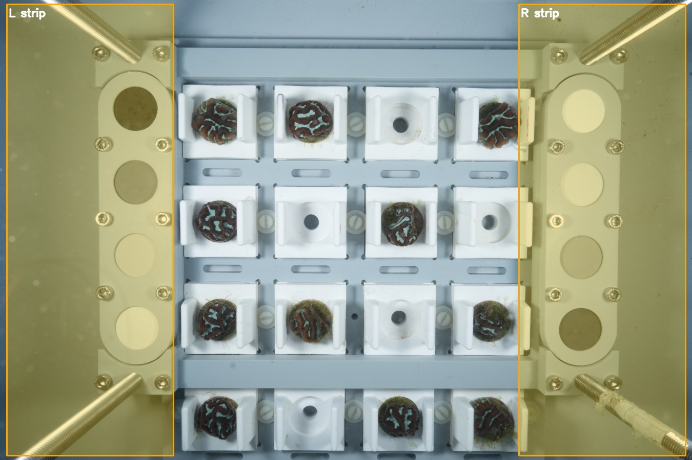
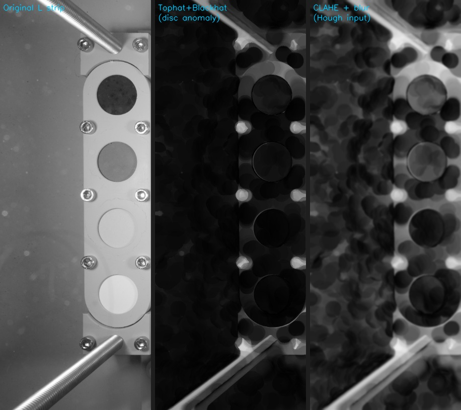
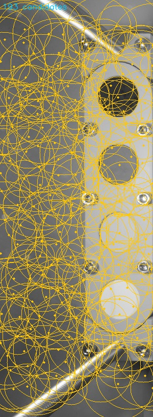
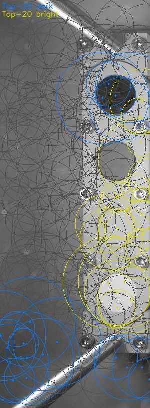
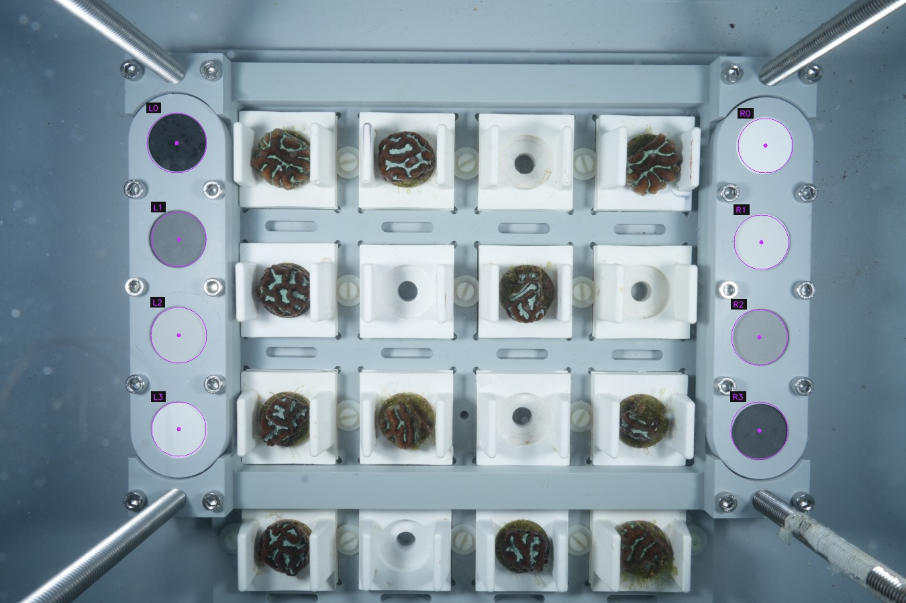
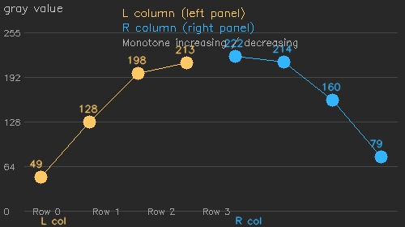
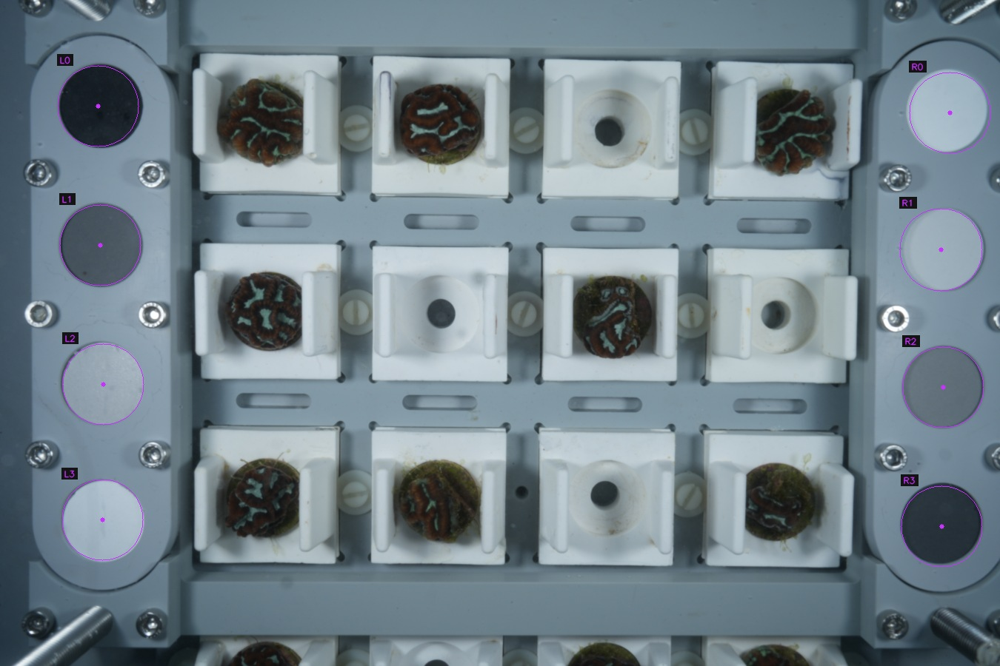
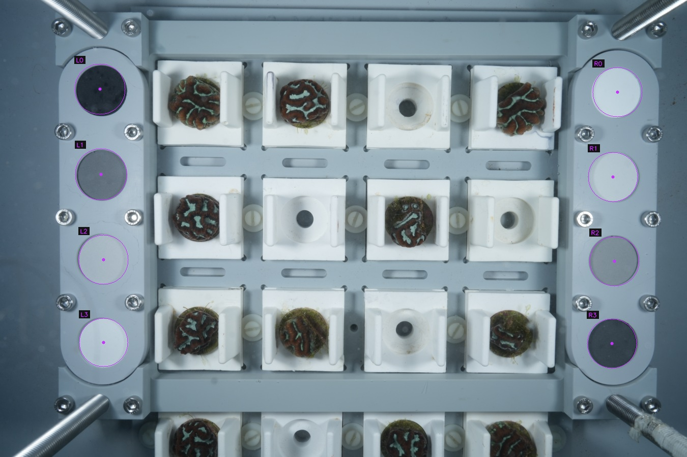
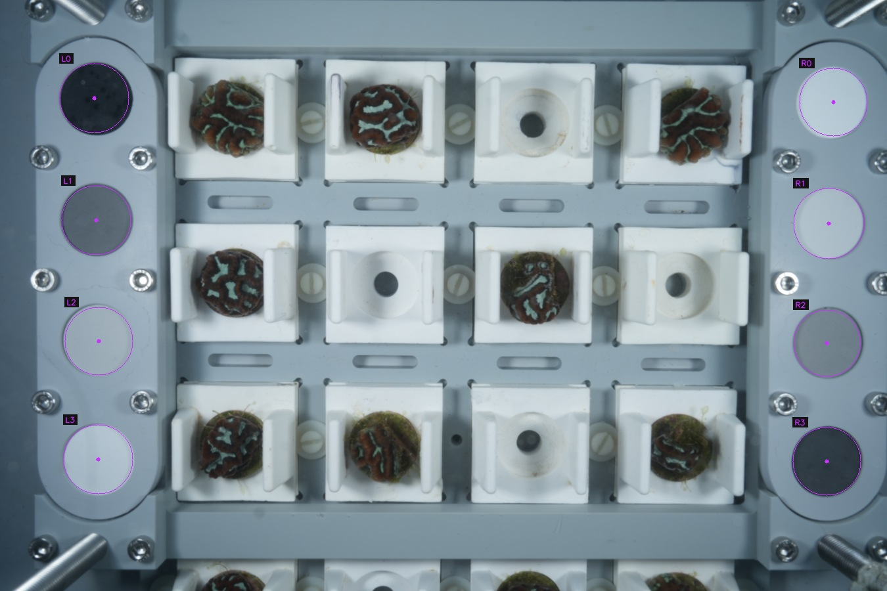

# Calibration Circle Detection

The coral monitoring rig carries 8 solid-colour calibration discs — 4 on the
left panel and 4 on the right — mounted in a fixed 2-column × 4-row grid.
Before any coral analysis, `detect_calibration_circles.py` locates these discs
automatically to provide a consistent luminance reference for every image.

---

## Why calibration discs?

Ocean and flash lighting vary between dives, cameras, and days.
The 8 discs span the full luminance range by design:

- **Left column** — dark-to-bright, top to bottom (rows 0 → 3 increase in gray value)
- **Right column** — bright-to-dark, top to bottom (rows 0 → 3 decrease in gray value)

Once located, each disc provides a known gray reference point that can be used to
normalise or correct the rest of the image.

---

## Detection pipeline

### Step 1 — Define search strips

The discs are mechanically constrained to the outer ¼ of the image on each side.
The detector crops a narrow vertical strip from the left edge and a mirror strip
from the right edge, discarding the coral-covered interior.



*Orange boxes show the L strip (left) and R strip (right) searched for calibration discs.*

Each strip spans the full image height and roughly 1.5–2 disc-diameters wide.
All subsequent processing runs independently on each strip.

---

### Step 2 — Preprocessing

Processing a 7008 × 4672 image at full resolution is slow and makes Hough
circle detection noisy.  The image is first downscaled to **25 %** (≈ 1752 × 1168 px).
At this scale the calibration discs are 70–130 px in diameter — ideal for the
circular Hough transform.

Two preprocessing paths are applied to the strip:

| | |
|---|---|
| **Disc-anomaly image** | Morphological *tophat* (highlights bright blobs) + *blackhat* (highlights dark blobs), combined then CLAHE-enhanced. This suppresses the uniform panel background and makes both the dark and bright discs equally salient. |
| **Raw strip** | CLAHE applied directly to the gray strip, then Gaussian-blurred. Used as a second Hough source to catch discs the anomaly image may miss. |



*Left: original L strip.  Centre: tophat+blackhat disc-anomaly image.  Right: CLAHE-enhanced input for Hough.*

---

### Step 3 — Find Hough circle candidates

`cv2.HoughCircles` is run eight times (4 sensitivity levels × 2 preprocessed
sources) with a radius search range derived from the expected disc size
(`CALIB_R_MIN_FRAC = 2 %` to `CALIB_R_MAX_FRAC = 7.5 %` of image width).
Results from all eight sweeps are merged and deduplicated by minimum inter-centre
distance (= `r_min`).



*All surviving Hough candidates in the L strip (cyan circles).  Many are false
positives from panel hardware, coral structure, and reflections.*

Candidates whose centres fall within `r_max / 2` pixels of the strip top or
bottom are removed — these are panel corners and diagonal rail cross-sections,
not discs.

---

### Step 4 — Select anchor candidates

Each detected candidate is assigned a mean gray value, sampled with a small
fixed-radius disc (`r_min // 2`).  Using a **fixed** radius rather than the
Hough-detected radius is critical: the bright white disc is often detected with
a 2× inflated radius, and sampling at the inflated radius dilutes the white
disc's mean gray with surrounding grey panel — causing it to rank poorly in
brightness.  Fixed sampling prevents this.

Candidates are then sorted into two lists:

- **Top-20 darkest** — the genuine black calibration disc is always among these
- **Top-20 brightest** — the genuine white calibration disc is always among these



*Blue = top-20 darkest candidates.  Yellow = top-20 brightest candidates.
The calibration discs are always present in both groups.*

---

### Step 5 — Anchor-pair search and intermediate fill

Every combination of 1 dark candidate × 1 bright candidate (up to 400 pairs)
is evaluated as potential column endpoints.  A pair is accepted as a hypothesis
only if it passes geometric sanity checks:

| Check | Constraint |
|---|---|
| x-alignment | `|Δx| ≤ 3.5 × r_max` (same vertical column) |
| y-span | 35 % – 82 % of strip height (covers rows 0 – 3, not beyond) |
| Luminance contrast | `|Δgray| ≥ 60` (must span a meaningful range) |
| Column position | Mean x ≥ 30 % of strip width (rejects features at the inner edge) |
| x-spread | Coefficient of variation `std(x) / r_min ≤ 0.60` (column must be straight) |

For each passing pair, the two intermediate row positions are **predicted** from
equal spacing and filled with the nearest Hough candidate within a tight
`±1.5 × r_min` horizontal and `±0.65 × step` vertical window:


*Red = detected anchor (dark disc).  Green = detected anchor (bright disc).
Yellow = intermediate discs found by nearest-neighbour search.
White crosses = predicted positions used to guide the search.*

The resulting 4-circle column is scored:

```
score = (gray_range / 200) × monotonicity
        ──────────────────────────────────────────────────────────────
        1 + sp_cv + r_cv × 0.5 + x_cv × 2.0 + y_match_err × 2.0
```

| Term | What it rewards / penalises |
|---|---|
| `gray_range / 200` | Columns that span the full luminance range (0–255) score higher |
| `monotonicity` | 1.0 if grays increase or decrease monotonically top-to-bottom, else 0.6 |
| `sp_cv` | Penalises uneven row spacing (calibration discs are mechanically evenly spaced) |
| `r_cv × 0.5` | Penalises inconsistent detected radii |
| `x_cv × 2.0` | Penalises columns that are not vertically aligned |
| `y_match_err × 2.0` | Penalises R columns whose row heights don't match the L column |

The last term exploits the fact that both columns are on the same physical rack
and therefore share the same row heights.  **L is always processed first**; its
detected y-positions are passed as a soft reference constraint when scoring R
column hypotheses.

---

### Step 6 — Radius normalisation

Hough occasionally detects the dark or bright anchor disc with a 2× inflated
radius (the circle accumulator peaks on the disc boundary, not its centre).
The two intermediate discs (rows 1 and 2) have reliable radii because they are
mid-gray and don't trigger this over-detection.  Their median is used as the
per-column radius reference, and any circle with a detected radius more than
30 % above the reference is capped:

```python
ref_r = median(radius[row_1], radius[row_2])
cap   = int(ref_r * 1.3)
for c in column:
    if c['radius'] > cap:
        c['radius'] = ref_r
```

---

### Step 7 — Final result

Eight circles are returned, labelled L0–L3 (left column, top-to-bottom) and
R0–R3 (right column, top-to-bottom), with full-resolution centre coordinates
and radius.



*All 8 calibration discs correctly detected on DSC00148 (mean centre error 12 px at full resolution).*

---

## Gray value sequence

The discs are designed to produce a monotone gray sequence in each column.
Confirming monotonicity is one of the scoring criteria — it is a strong signal
that the detector found the actual calibration hardware and not background clutter:



*L column (blue) increases from dark to bright; R column (orange) decreases.
Gray values sampled with a fixed `r_min // 2` radius at the detected centres.*

---

## Results across the test set

The detector was validated against 6 hand-labelled images (8 circles each, 48 total):

| Image | Circles found | Mean centre error | Notes |
|---|---|---|---|
| DSC00138 | 8 / 8 | 23 px | |
| DSC00146 | 8 / 8 | 27 px | |
| DSC00147 | 8 / 8 | 23 px | |
| DSC00148 | 8 / 8 | **12 px** | best case |
| DSC00149 | 8 / 8 | 51 px | rack strut confuses top anchor; rows 1-3 within 36 px |
| DSC00150 | 8 / 8 | 16 px | |

 

 

All 48 circles detected correctly across all images.  Runtime ≈ 1.9 s/image on a
standard desktop CPU.

---

## Output files

Each processed image produces three files in the output directory:

| File | Contents |
|---|---|
| `<stem>_calibration_rois.json` | Full-resolution centre coordinates, radii, and bounding boxes for all 8 circles |
| `<stem>_calibration_rois.csv` | Same data in CSV format for downstream tools |
| `<stem>_calibration_annotated.jpg` | Scaled preview with detected circles and labels overlaid |

Example JSON entry:

```json
{
  "side": "L",
  "idx": 2,
  "x": 1164,
  "y": 2380,
  "width": 432,
  "height": 432,
  "center_x": 1380,
  "center_y": 2596,
  "radius": 216
}
```

---

## Usage

```bash
# Single image
python3 detect_calibration_circles.py path/to/image.JPG output/

# Whole directory
python3 detect_calibration_circles.py path/to/images/ output/
```

Key constants in `detect_calibration_circles.py`:

| Constant | Default | Description |
|---|---|---|
| `PROCESS_SCALE` | `0.25` | Downscale factor for Hough processing |
| `CALIB_X_LO_FRAC` | `0.010` | Inner bound of each search strip (fraction of image width) |
| `CALIB_X_HI_FRAC` | `0.250` | Outer bound of each search strip |
| `CALIB_R_MIN_FRAC` | `0.020` | Minimum disc radius (fraction of image width) |
| `CALIB_R_MAX_FRAC` | `0.075` | Maximum disc radius |
| `N_ROWS` | `4` | Discs per column |
