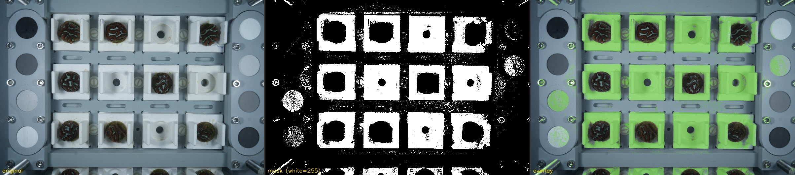

# Training the Random Forest Classifiers

The detection pipeline uses two pixel-level binary classifiers, both Random Forests trained on hand-labeled bounding boxes from coral rack images:

| Classifier | Positive class | Negative class | Script |
|---|---|---|---|
| `WhiteTabClassifier` | white square frame | coral + background | `train_white_classifier.py` |
| `CoralClassifier` | coral tissue | white frame + background | `train_coral_classifier.py` |

Each classifier takes 9 per-pixel colour features (BGR, HSV, CIE L\*a\*b\*) and is trained on pixels sampled from your labeled bounding boxes.

---

## Directory layout

```
train/
  images/        training images (copies of a subset from images/)
  labels/        one JSON label file per image
  models/        trained .joblib files + _info.txt reports
  annotated/     label visualisations produced by label_annotate.py
  output_masks/  pixel-level mask previews from test_classifier.py
```

---

## Step 1 — Prepare training images

Run `label_annotate.py` from the project root. On first run it randomly copies 10 images from `images/` into `train/images/` and writes a JSON label template for each one. If a matching `output/<stem>_rois.json` exists (from the detector), the detected white squares are pre-loaded as `"white"` ROIs so you only need to add the `"other"` and `"coral"` samples.

```bash
python3 label_annotate.py
```

You can also drop images manually into `train/images/` and create label files by hand — the format is shown in [Label JSON format](#label-json-format) below.

---

## Step 2 — Draw bounding box labels

`bbox_labeler.py` is an interactive GUI for drawing training labels on each image. Run it from the project root:

```bash
python3 bbox_labeler.py
```


### Controls

| Key / action | Effect |
|---|---|
| `w` | Switch active class to **WHITE** (green boxes) |
| `c` | Switch active class to **CORAL** (orange boxes) |
| `o` | Switch active class to **OTHER** (red boxes) |
| left-drag | Draw a new bounding box in the active class |
| right-click | Delete the box under the cursor |
| `z` | Undo the last drawn box |
| `n` | Save and advance to the next image |
| `p` | Save and go back to the previous image |
| `s` | Save current image's labels without changing image |
| `r` `r` | Press twice to clear all boxes for this image |
| `q` / Esc | Save and quit |

### What to label

- **WHITE** — any region of white plastic square frame (tabs, edges, flat faces). Include the full interior of each square. Also label any white structural elements elsewhere in the image.
- **OTHER** — everything that is not white frame: the grey panel, frame bolts, calibration discs, the metal rack, background, empty space. Aim for several spatially diverse "other" boxes per image.
- **CORAL** — the coral tissue region inside an occupied square. Label only the coral itself, not the surrounding white frame.

A good label set has at least 5–10 boxes of each class per image, covering the range of lighting conditions and angles present in your image set.

Labels are saved to `train/labels/<stem>.json` automatically when you navigate or quit.

---

## Step 3 — Verify labels

Re-run `label_annotate.py` at any time to produce annotated preview images in `train/annotated/`. Each image shows every labeled box with a colour-coded fill and border so you can visually check coverage and fix mistakes.

```bash
python3 label_annotate.py
```


Green = **white**, red = **other**, orange = **coral**.  The summary bar at the top shows the count per class. If any box looks misaligned or covers the wrong region, edit the JSON directly or re-open `bbox_labeler.py` to adjust it.

---

## Step 4 — Train

### White frame classifier

Trains on ROIs labeled `"white"` (class 1) vs `"other"` and `"coral"` (class 0):

```bash
python3 train_white_classifier.py
```

### Coral classifier

Trains on ROIs labeled `"coral"` (class 1) vs `"white"` and `"other"` (class 0). Only JSON files that contain at least one `"coral"` ROI are used:

```bash
python3 train_coral_classifier.py
```

Both scripts:
- Print a per-class validation report on a held-out 20% of pixels
- Print feature importances (which colour channels matter most)
- Write `train/models/YYYYMMDD_<Name>.joblib` and a matching `_info.txt`

Example output:

```
Reading labels from train/labels/

  DSC00138:  coral=8  other/white=29
  DSC00140:  coral=5  other/white=22
  ...

Dataset: 1,557,840 pixels total  (64,000 coral,  1,493,840 white/other)

Training RandomForest  (200 trees, max_depth=20, class_weight='balanced') ...

Validation report (held-out 20% of pixels):
              precision    recall  f1-score   support

 white/other     0.9951    0.9816    0.9883    325461
       coral     0.9125    0.9753    0.9429     64000

    accuracy                         0.9806    389461

Feature importances:
    B  0.2118  ########
    a  0.1394  #####
    G  0.1217  ####
  ...

Model saved ->  train/models/20260623_CoralClassifier.joblib
```

> **Tip:** If precision is low (many false positives), add more `"other"` or `"white"` boxes in hard regions. If recall is low (missing detections), add more `"coral"` boxes from underrepresented lighting conditions.

---

## Step 5 — Verify with pixel masks

`test_classifier.py` runs the trained white classifier over each training image at 15% scale and saves three outputs per image: a binary mask, a colour overlay, and a side-by-side comparison panel.

```bash
python3 test_classifier.py
```



*Left: original image. Centre: binary mask (white=255, black=0). Right: original with white pixels highlighted green.*

Check that:
- The white squares are cleanly masked with few holes
- Coral, background, and calibration discs are dark (not falsely classified as white)
- Edges are sharp — the classifier runs at 15% scale, so minor fringing is normal

If the mask has large gaps inside the squares, add more `"white"` boxes covering those regions and retrain. If calibration discs or the metal frame are partially white, add `"other"` boxes over those areas.

---

## Step 6 — Deploy the model

Copy the new `.joblib` file from `train/models/` to the project root:

```bash
cp train/models/YYYYMMDD_WhiteTabClassifier.joblib .
cp train/models/YYYYMMDD_CoralClassifier.joblib .
```

`detect_corals_on_white_squares.py` loads the most recently dated model that matches the expected filename pattern (`*WhiteTabClassifier.joblib` / `*CoralClassifier.joblib`) from the working directory automatically.

---

## Label JSON format

```json
{
  "image": "train/images/DSC00138.JPG",
  "image_width": 7008,
  "image_height": 4672,
  "rois": [
    { "label": "white", "row": 0, "col": 0, "x": 1422, "y": 1193, "width": 933, "height": 101 },
    { "label": "white",                      "x": 3910, "y":  456, "width": 826, "height": 363 },
    { "label": "other",                      "x":   80, "y":  300, "width": 280, "height": 280 },
    { "label": "coral",                      "x": 1690, "y":  755, "width": 331, "height": 272 }
  ]
}
```

The `"row"` and `"col"` fields are optional metadata from the detector — they are carried through for reference but are not used during training. Coordinates are in full-resolution pixels.
